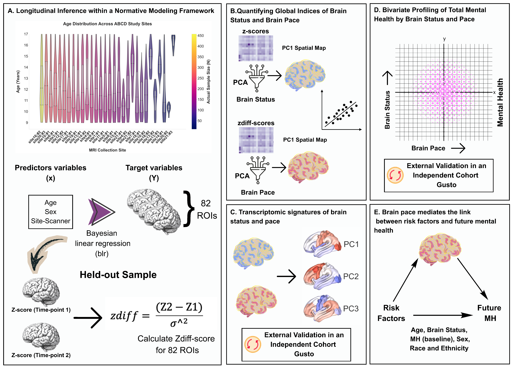

# Neurodevelopmental Pace

## Neurodevelopmental Pace Mediates the Association Between Risk Factors and Future Adolescent Psychopathology

### Authors
Niousha Dehestani, Sina Mansour L., Kwun Kei Ng, Thuan Tinh Nguyen,
Su Xian Joanna Chong, Qian Xing, Tim J. Silk, Sarah Whittle,
Yap Seng Chong, Johan G. Eriksson, Michael J. Meaney,
Ai Peng Tan, Juan Helen Zhou

---

## Overview

This repository contains the analysis pipeline, normative modeling framework, longitudinal neurodevelopment analyses, and visualization code associated with the manuscript.

The project investigates how deviations in neurodevelopmental pace and brain status relate to future psychopathology during adolescence using longitudinal structural MRI data from the ABCD Study and the GUSTO cohort.

---

## Abstract

Many psychiatric disorders first emerge or intensify during adolescence, driven by interacting biological, environmental, and lifestyle factors. Characterizing how these factors become embedded in the developing brain requires capturing dynamic trajectories. However, most neuroimaging studies rely on cross-sectional measures that overlook intra-individual developmental trajectories.

Here, we applied a normative modeling framework adapted for inference to longitudinal structural MRI data from the Adolescent Brain Cognitive Development (ABCD) Study (17,137 scans) to dissociate two dimensions of neurodevelopment:

- Brain status
- Brain pace

These dimensions exhibited distinct spatial and biological signatures, mapping onto separable cortical gene-expression gradients.

Clinically, individuals with both lower brain status and accelerated brain pace showed the highest psychopathology burden, a pattern replicated in the independent Growing Up in Singapore Towards Healthy Outcomes (GUSTO) cohort.

Importantly, brain pace predicted future psychopathology more strongly than brain status. Moreover, brain pace mediated associations between modifiable risk factors including adiposity, pubertal stage, sleep disturbance, and socioeconomic adversity and future psychopathology.

Together, these findings identify neurodevelopmental pace as a biologically grounded and clinically informative marker of adolescent mental health risk.

---
## Overview Figure

  

---
## Repository Structure

scripts/             Pipeline execution scripts 
data/                Data directory  
results/             Output figures, tables, and models  
manuscript/          Paper-related material  
docs/                Documentation and presentations  

---

## Datasets

### ABCD Study
Adolescent Brain Cognitive Development (ABCD) Study, https://doi.org/10.82525/jy7n-g441

### GUSTO Cohort
Growing Up in Singapore Towards Healthy Outcomes, https://gustodatavault.sg

---
## Code Structure

  All analysis scripts are organized under `scripts/` in sequential pipeline order:

  ### `01_data_aggregation/`
  Prepares raw neuroimaging and phenotypic data for modeling.
  - `01.1_t1_qc.ipynb` — Applies quality control filters to T1 cortical/subcortical volumetric data from ABCD Release 6.0
  - `01.2_risk_factors.ipynb` — Cleans and processes modifiable risk factor variables (adiposity, puberty, sleep, SES)
  - `01.3_train_test_split.ipynb` — Partitions data into normative training (healthy) and test sets

  ### `02_Normative_Model/`
  Fits Bayesian Linear Regression (BLR) normative models and derives deviation scores.
  - `02.1_normative_model_blr.ipynb` — Fits the normative model to cortical thickness data using PCNtoolkit
  - `02.2_longitudinal_predict_healthy.ipynb` — Generates longitudinal predictions for the healthy reference cohort
  - `02.3_longitudinal_predict.ipynb` — Applies the fitted model to generate z-scores (brain status) and z-score differences (brain pace) across all participants
  - `02.4_zdiff_validation.ipynb` — Validates deviation scores against the GUSTO cohort via transfer learning
  - `02.5_normative_centile_plots.ipynb` — Produces centile trajectory visualizations for model quality assessment

  ### `03_Brain_Maps/`
  Derives principal components of brain deviation scores and maps them to established neuroscience atlases.
  - `03.1_pca_brain_scores.ipynb` — Runs PCA on parcel-wise z-scores (brain status) and z-score differences (brain pace) for the ABCD cohort
  - `03.2_pca_external_transfer.ipynb` — Projects PCA components onto the GUSTO cohort for cross-cohort validation
  - `03.3_neuromaps_brainsmash.ipynb` — Correlates brain PC maps with neuroscience reference maps (neuromaps) and tests spatial specificity with BrainSMASH spin permutations (ABCD)
  - `03.4_neuromaps_brainsmash_gusto.ipynb` — Repeats neuromaps/BrainSMASH analysis for the GUSTO cohort
  - `03.5_neuromaps_brainsmash_gusto_longitudinal.ipynb` — Extends neuromaps analysis to longitudinal (pace) components in GUSTO

  ### `04_psychopathology_application/`
  Links brain pace and status components to future psychopathology and modifiable risk factors.
  - `04.1_cohort_mental_health_comparison.ipynb` — Compares mental health scores across cohorts and time points
  - `04.2_quadrant_classification.ipynb` — Classifies participants into brain status × brain pace quadrants and examines psychopathology burden per quadrant
  - `04.3_partial_correlations.ipynb` — Computes partial correlations between PC scores and future internalizing/externalizing symptoms
  - `check_correlations.R` — Checks inter-variable correlations and VIF for mediation model covariates
  - `med_medpkg.R` — Runs single-mediator mediation analyses (risk factor → brain pace → psychopathology) using the `mediation` package
  - `med_multipred.R` — Extends mediation to multiple simultaneous risk factor predictors

---

## Citation

If you use this repository, please cite the associated manuscript.

---

## License

This project is currently under active development.
